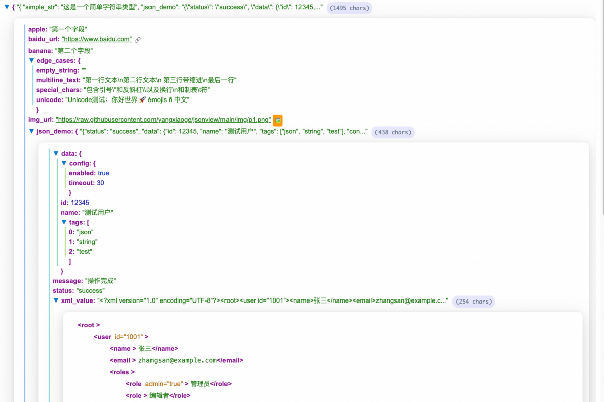
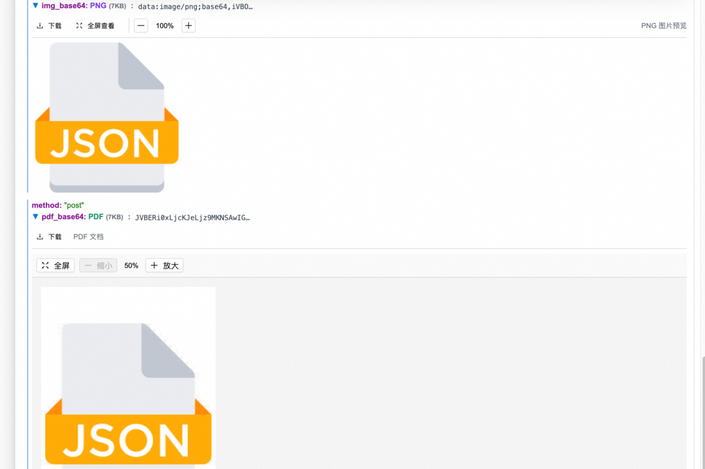
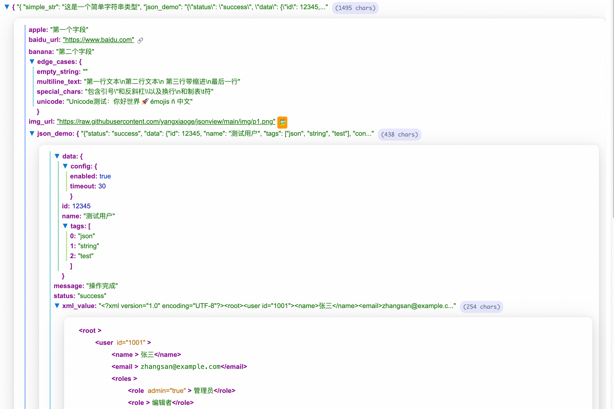
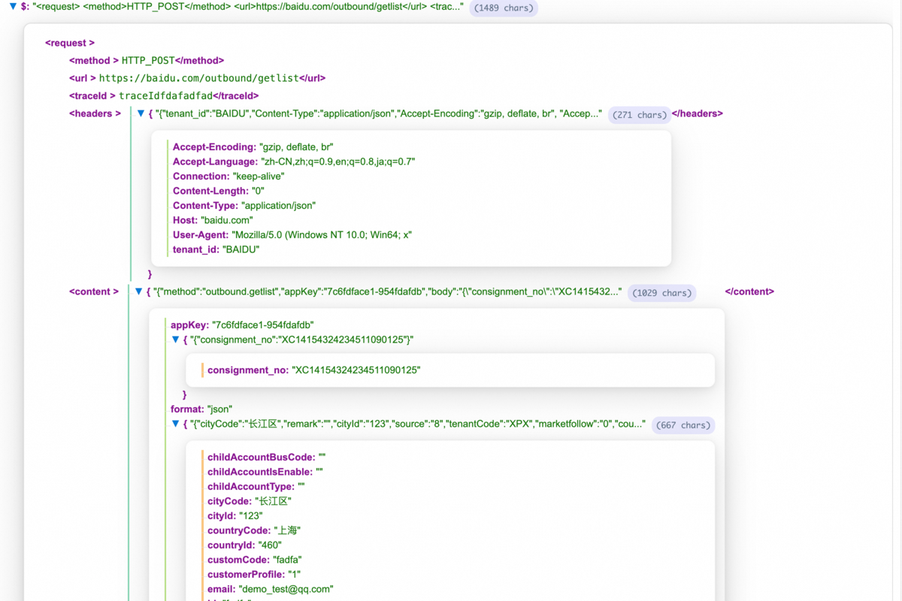

##    Nested JSON Viewer - 嵌套JSON查看器

**English**: A powerful browser extension for pretty-printing and visualizing nested JSON, XML, Base64 images, and PDFs.

**中文**：一个强大的浏览器扩展，用于美化和可视化嵌套JSON、XML、Base64图片和PDF文件。

---

### 🚀 功能特性 | Features

- **智能格式识别**：自动识别JSON、XML、Base64图片、Base64 PDF、URL链接等
- **树形结构展示**：层次化展示复杂数据结构
- **图片预览**：支持Base64图片内联预览
- **PDF预览**：支持Base64 PDF文件预览
- **URL操作**：支持图片和链接的快速操作
- **复制功能**：一键复制任意节点数据
- **响应式设计**：适配不同屏幕尺寸

---

## Downloads

<a href="https://chromewebstore.google.com/detail/nested-json-viewer/aebhckhcgijcdfidnpfadpidllkcdjdg">
  
</a>

[](https://chromewebstore.google.com/detail/nested-json-viewer/aebhckhcgijcdfidnpfadpidllkcdjdg)

## About

### JSON格式修复：
使用开源包jsonrepair，修复JSON格式错误

### 测试字段串：

1. 简单JSON字段串：包含value有json字段串、base64pdf、base64image

```json
{
    "method": "post",
    "body": "{\"params\":{\"logistics_interface\":\"{\\\"traceId\\\":\\\"fadfa\\\",\\\"headers\\\":\\\"{\\\\\\\"tenant_id\\\\\\\":\\\\\\\"PXX\\\\\\\",\\\\\\\"Content-Type\\\\\\\":\\\\\\\"application/json\\\\\\\"}\\\",\\\"method\\\":\\\"HTTP_POST\\\",\\\"url\\\":\\\"https://baidu/outbound/getlist\\\",\\\"content\\\":\\\"{\\\\\\\"method\\\\\\\":\\\\\\\"outbound.getlist\\\\\\\",\\\\\\\"appKey\\\\\\\":\\\\\\\"7c693cefdfa1-fadfafaf-954ab805aedb\\\\\\\",\\\\\\\"body\\\\\\\":\\\\\\\"{\\\\\\\\\\\\\\\"consignment_no\\\\\\\\\\\\\\\":\\\\\\\\\\\\\\\"XCN141530fdaf11090125\\\\\\\\\\\\\\\"}\\\\\\\",\\\\\\\"fpxUser\\\\\\\":\\\\\\\"{\\\\\\\\\\\\\\\"cityCode\\\\\\\\\\\\\\\":\\\\\\\\\\\\\\\"长期区\\\\\\\\\\\\\\\",\\\\\\\\\\\\\\\"remark\\\\\\\\\\\\\\\":\\\\\\\\\\\\\\\"\\\\\\\\\\\\\\\",\\\\\\\\\\\\\\\"cityId\\\\\\\\\\\\\\\":\\\\\\\\\\\\\\\"4155\\\\\\\\\\\\\\\",\\\\\\\\\\\\\\\"source\\\\\\\\\\\\\\\":\\\\\\\\\\\\\\\"8\\\\\\\\\\\\\\\",\\\\\\\\\\\\\\\"tenantCode\\\\\\\\\\\\\\\":\\\\\\\\\\\\\\\"XPX\\\\\\\\\\\\\\\",\\\\\\\\\\\\\\\"marketfollow\\\\\\\\\\\\\\\":\\\\\\\\\\\\\\\"0\\\\\\\\\\\\\\\",\\\\\\\\\\\\\\\"countryId\\\\\\\\\\\\\\\":\\\\\\\\\\\\\\\"460\\\\\\\\\\\\\\\",\\\\\\\\\\\\\\\"customCode\\\\\\\\\\\\\\\":\\\\\\\\\\\\\\\"FSDFDA\\\\\\\\\\\\\\\",\\\\\\\\\\\\\\\"openedBrandCodes\\\\\\\\\\\\\\\":\\\\\\\\\\\\\\\"[\\\\\\\\\\\\\\\\\\\\\\\\\\\\\\\"FB4\\\\\\\\\\\\\\\\\\\\\\\\\\\\\\\"]\\\\\\\\\\\\\\\",\\\\\\\\\\\\\\\"organizationId\\\\\\\\\\\\\\\":\\\\\\\\\\\\\\\"\\\\\\\\\\\\\\\",\\\\\\\\\\\\\\\"countryCode\\\\\\\\\\\\\\\":\\\\\\\\\\\\\\\"中国香港\\\\\\\\\\\\\\\",\\\\\\\\\\\\\\\"imageUrl\\\\\\\\\\\\\\\":\\\\\\\\\\\\\\\"\\\\\\\\\\\\\\\",\\\\\\\\\\\\\\\"nickname\\\\\\\\\\\\\\\":\\\\\\\\\\\\\\\"\\\\\\\\\\\\\\\",\\\\\\\\\\\\\\\"id\\\\\\\\\\\\\\\":\\\\\\\\\\\\\\\"413123123\\\\\\\\\\\\\\\",\\\\\\\\\\\\\\\"locked\\\\\\\\\\\\\\\":\\\\\\\\\\\\\\\"false\\\\\\\\\\\\\\\",\\\\\\\\\\\\\\\"markCodesStr\\\\\\\\\\\\\\\":\\\\\\\\\\\\\\\"{\\\\\\\\\\\\\\\\\\\\\\\\\\\\\\\"fb4MarkCode\\\\\\\\\\\\\\\\\\\\\\\\\\\\\\\":\\\\\\\\\\\\\\\\\\\\\\\\\\\\\\\"XPX312312\\\\\\\\\\\\\\\\\\\\\\\\\\\\\\\"}\\\\\\\\\\\\\\\",\\\\\\\\\\\\\\\"recommender\\\\\\\\\\\\\\\":\\\\\\\\\\\\\\\"\\\\\\\\\\\\\\\",\\\\\\\\\\\\\\\"email\\\\\\\\\\\\\\\":\\\\\\\\\\\\\\\"testqq@qq.com\\\\\\\\\\\\\\\",\\\\\\\\\\\\\\\"stat\\\\\\\\\\\\\\\":\\\\\\\\\\\\\\\"1\\\\\\\\\\\\\\\",\\\\\\\\\\\\\\\"salt\\\\\\\\\\\\\\\":\\\\\\\\\\\\\\\"\\\\\\\\\\\\\\\",\\\\\\\\\\\\\\\"provinceCode\\\\\\\\\\\\\\\":\\\\\\\\\\\\\\\"九龙\\\\\\\\\\\\\\\",\\\\\\\\\\\\\\\"customerProfile\\\\\\\\\\\\\\\":\\\\\\\\\\\\\\\"1\\\\\\\\\\\\\\\",\\\\\\\\\\\\\\\"mobile\\\\\\\\\\\\\\\":\\\\\\\\\\\\\\\"312312\\\\\\\\\\\\\\\",\\\\\\\\\\\\\\\"parentUserId\\\\\\\\\\\\\\\":\\\\\\\\\\\\\\\"\\\\\\\\\\\\\\\",\\\\\\\\\\\\\\\"userName\\\\\\\\\\\\\\\":\\\\\\\\\\\\\\\"999999\\\\\\\\\\\\\\\",\\\\\\\\\\\\\\\"userId\\\\\\\\\\\\\\\":\\\\\\\\\\\\\\\"3123123123123\\\\\\\\\\\\\\\",\\\\\\\\\\\\\\\"provinceId\\\\\\\\\\\\\\\":\\\\\\\\\\\\\\\"3746\\\\\\\\\\\\\\\",\\\\\\\\\\\\\\\"markCode\\\\\\\\\\\\\\\":\\\\\\\\\\\\\\\"\\\\\\\\\\\\\\\",\\\\\\\\\\\\\\\"childAccountType\\\\\\\\\\\\\\\":\\\\\\\\\\\\\\\"\\\\\\\\\\\\\\\",\\\\\\\\\\\\\\\"roleIds\\\\\\\\\\\\\\\":\\\\\\\\\\\\\\\"\\\\\\\\\\\\\\\",\\\\\\\\\\\\\\\"childAccountIsEnable\\\\\\\\\\\\\\\":\\\\\\\\\\\\\\\"\\\\\\\\\\\\\\\",\\\\\\\\\\\\\\\"salesman\\\\\\\\\\\\\\\":\\\\\\\\\\\\\\\"XPX312\\\\\\\\\\\\\\\",\\\\\\\\\\\\\\\"userType\\\\\\\\\\\\\\\":\\\\\\\\\\\\\\\"0\\\\\\\\\\\\\\\",\\\\\\\\\\\\\\\"pushed\\\\\\\\\\\\\\\":\\\\\\\\\\\\\\\"true\\\\\\\\\\\\\\\",\\\\\\\\\\\\\\\"childAccountBusCode\\\\\\\\\\\\\\\":\\\\\\\\\\\\\\\"\\\\\\\\\\\\\\\"}\\\\\\\",\\\\\\\"fpxUserId\\\\\\\":\\\\\\\"fadfaffdafadff-rqewreqwrq\\\\\\\",\\\\\\\"format\\\\\\\":\\\\\\\"json\\\\\\\",\\\\\\\"timestamp\\\\\\\":\\\\\\\"43141324\\\\\\\",\\\\\\\"language\\\\\\\":\\\\\\\"cn\\\\\\\"}\\\"}\",\"data_digest\":\"BvRjkbJzwOoWI3ei+fdasfaf==\",\"partner_code\":\"XPXX\",\"from_code\":\"XPX_INNER\",\"msg_type\":\"XPXXP_INTER\",\"msg_id\":\"431241243241412\"},\"type\":\"KV\"}",
    "pdf_base64": "JVBERi0xLjcKJeLjz9MKNSAwIG9iago8PAovVHlwZSAvWE9iamVjdAovU3VidHlwZSAvSW1hZ2UKL1dpZHRoIDI1NgovSGVpZ2h0IDI1NgovQml0c1BlckNvbXBvbmVudCA4Ci9Db2xvclNwYWNlIC9EZXZpY2VHcmF5Ci9GaWx0ZXIgWy9GbGF0ZURlY29kZSAvRENURGVjb2RlXQovRGVjb2RlUGFybXMgW251bGwgPDwKL1F1YWxpdHkgNjAKPj5dCi9MZW5ndGggMTY3MAo+PgpzdHJlYW0KeJzNVX0803kc/y5jS6GwHqTNNdUkdeUhKZYKHZVQllXTcx6uhGS2q1GKlIe5juvKc1KMiURsCBflXEc0yk2zeVx5KMN22e9+6+nu6NXV/XXf3+evz/f3/r4/78/n8/18oWboKVgH1CarTlFFq01RnaKurqahpYfR0tTUWqiLnam3xGDZ10sMjBYbW9hbGZvZrlhstIZkbbtxs7OL83Ir8h7ylt32Ts6OUDmYgkYA+ENMB1AVwAGAUEa8WeDdQkxSQiqroNAwE/xDwTQwCaGkNAmppKyMRMK7J+B9gJyurPnVMmsVLac9qHm+2stDmClo/NqbdzHO9QP6xnv9Tk1WnTFz1myd+QsWEgwWmZiarTBfabFuvY2t3YZv7F22bnMlbXcj79t/4OAhD08v/2MBxwOpQbTToWfOhoWfi4j9/uIPcfE/XvopNe1q+rWM6zcy8/JvFdwuLLpTXFFZ9fO96pr7DxoeNTY95jW3PBG0C0UdnV3dPb2DL18NSYZHRqUy6AlAK/QQwStVQkZqfu565UtRQLeTm1VBQeXWZ+9NlKH7AjSVjIta8VYRFr7ix8UDk4JBufYtJxvtN2azetnO9fsS9eOMm3atU5LyLlPbytExt9MFo743/Y1S1ZMZmhAIg0AmpyKCkPrODP3verCFaga7AhFHM7BCpqy9NCT1b9t1HMYzX+JllkeMfCSuqNBphOtmx77eLxF3HHvPq+06EgIBkV8DBMRFcluu/C84IZXztFqO0pIW3zun0R/kfT4AR2+6SJNFQYBSSnqPd9rBR0GAWesAgRyhVGdERvjCCHyoOLmd0VJ5SbTIu6079Qv5MdxnDKnurTJZH5HJZvwD/RnsnxL/WfyfEv85EXxCvIKf164RUpVllp9WhQyeWRTCOP+B3+3fxCvYu9iYJ9UH2hPs+dNmmBYdTp66G+s7evCmgie7XwkCNR3pEOD5vo6kj2l/aIh35k6k1q0um9mbdaVTEN31UMKyUJxIL4fAy5WeDEkrA0+BgM14GCmYKoQFuchLkkSGKoog+APE11Fk97FAXA2vrH48APMMa65I4FY4gV1S1buKuIt9woYDV1CM8mL5M5hGrd8YqoeXXuPyx6sjsFUGOzj11ByZJ/5AVJBb2l7z3ebmr60xdTCLKztsaFXbNC/DQ/sTX244+dy7l1HJpSfBzqUaPbVvnUORsLPAa2JM57O6zcjDF4cDmcGrq5fVJB+JLMTaSSTs6YMqYXTBmA2r34W/EvU784Td6HFWJiHbXaM7sFSv0fXX+5aimLFmXiN8U2kjRI3u4xTco7i33p45Cq9X04QiEa5nQ6ApaaQNAmtNk9rV1GurdPzd+BkcPw3uHFr0QD9lNuwcqZSdf+ssmSeLHnjhti0lpcdfTOaWJnxbk7e56siRCKCfVK5EGRSMqddWyvxaWhZyYnFcPC1p4AX51vji2mi74DdFkFbWakmvPBIbVunMjQ836cznOlJFOJqZBCfgc3A7G7rqA+iRFh3MqyHBrdxZ09DE8Hm3rebAbSO5BoGn7mPakr6PnKzogjPfbYCrKnaGwG13mQFh1AcC+MeXIXCYMeTCK56Q8TdGwQzi5XbZDvIWRvfVNEHZ62iyz1gBBOodKeKPAmyopKpoKbZg6R8HIJAaG30Wbk1Lz7JhHtyXlvTsj0IwAndNoojWWPYiXh5h//8VkzKgVvGU+mgjs3nRpalBVqx0u15v/oT58PYaIAefi32FmzY1npphjbWW954hXmchD9qqh2YZ1OAvkHJG97WbJQV6zi0tWNhypH7N8twHDiE8fMrwavpwToZc0xIlP03zkSvbyU1GTeuwnfvPtrnmxpHMtzqEHtz3HJGtM4EzP4NnQvdMnBNJrjDYImD2TXdzLFqQZqX/25qHw/yE6vQGnHhn2blSfM/juLwd3XknMl+EOBFwJRdkojFhT5SluCbhUnNJ7C/V+on+G//LgCjkaMAliIuHwK7ql6b9QxNziYoiivyaiOI78rW5Hp8z7SgIYbRUt8BR1seIYen8t0nXOrAjk1ppf+hwcivh4Z1nJ4vYyR4TyiX9414U/GRvYxYijlZaCU/LOnMVZb0xjyn4Yf65iJoLs7cHIP3U6I6hHN89rBYW6ZWN98lglKb5thhZDiPeS3x3KgKl1zAuT6FnkN8HG8YM+kQtNvF2230zcVXC+lOZ4YHoh1nYK7QANub4ob19Dsa6sUF1yyMMoZY/AVKco6wKZW5kc3RyZWFtCmVuZG9iago0IDAgb2JqCjw8Ci9UeXBlIC9YT2JqZWN0Ci9TdWJ0eXBlIC9JbWFnZQovV2lkdGggMjU2Ci9IZWlnaHQgMjU2Ci9CaXRzUGVyQ29tcG9uZW50IDgKL0NvbG9yU3BhY2UgL0RldmljZVJHQgovU01hc2sgNSAwIFIKL0ZpbHRlciAvRmxhdGVEZWNvZGUKL0xlbmd0aCAyODE0Cj4+CnN0cmVhbQp4nO2dwW7cNhCG/Wh9rB5770v0vq9QwLUvvgSwLwnSXJoglyAbwEWBnl3FStTNekUNZ4akyPkG36FostIs+f0SpdVurq5q1/H4ePzyNxh59fD25u7h9u7h5u7++u6++jRS2YX57v6fcH9DCnZczYUZjBf+f0tB63mmLlRzW8ZjxX8isLtqrsqQrPv/9aKg9ZxT34o1f33/icB+qrkno5L2nwjsoTj4N/SfCDSv5pIMjMR/ItCwOPjvwX8i0Krwfyf+E4Emhf/78Z8I1C/835X/RKBy4f/e/CcCNQv/d+g/EahW+L9P/4lAncL/3fpPBCoU/u/ZfyJQuvB/5/4TgaKF//v3nwiUK/zvwn8iUKjwvxf/iUCJwv+O/CcC7oX/fflPBHwL/7vznwg4Fv736D8R8Cr879R/IuBS+N+v/0TAXvjftf9EwFj437v/RMBS+D+A/0RAXfg/hv9EQFf4P4z/REBR+D+S/0Qgt/B/MP+JQFbh/3j+EwF54f+Q/hMBYeH/qP4TAUnh/8D+E4HNwv+x/ScC6cL/4f0nAonC/wj+E4G1wv8g/hOBi4X/cfwnAi8L/0P5TwTOCv+j+U8ETgv/A/pPBJbC/5j+E4G58D+s/0TgCv9j+08E8D+4/8EjgP/4HzkC+I//kSOA//gfOQL4j/+RI4D/+B85AviP/5EjgP/4HzkC+I//kSOA//gfOQL4j/+RI4D/+B85AviP/5EjgP/4HzkC+I//kSOA//gfOQL4j/+RI4D/+B85AviP/5EjgP/4HzkC+F+UDx8/NbeUCCQK//HfzH1ri/WF/6UZewk0c91tBPC/NBFOAf2ugvC/AhFOAa1FVhb+16G5n6XpdAmE/3UIsArCf9hg6IUQ/sM2b969by0q/v9f+N8qBRNjnQ7wHwJzfGztsqbwH3zAf4gM/kNk8B8ig/8QGfyHyOA/RAb/ITL4D5HBf4gM/kNk8B8ig/8QGfyHyOA/RAb/ITL4D5HBf4gM/kNk8B8ig/8QGfyHyOA/RAb/ITL4D5HBf4gM/kNk8B8ig/8QmQ79f/r16t/ff24/dDAAx8dJp45q6hb/wY1n/3uJwNwq/oMb3/3ffwSWPvEfvPjn1W+nXu22TpvEf/DizP99RuCsQ/wHL176v7cIvGwP/8GLi/7vJwIXe8N/8GLN/z1EYK0x/AcvEv63jUCiK/wHL9L+t4pAuiX8By82/a8fgc1+8B+8kPhfMwKSZvAfvBD6XycCwk7wH7yQ+186AvI28B+8yPK/XASyesB/8CLX/xIRyG0A/8ELhf++EVDsHf/BC53/XhHQ7Rr/wQu1//YIqPeL/+CFxX9LBCw7xX/wwui/LgLGPeI/eGH3PzcC9t3hP3gxieQiZE358R+88PJfGIGnA8CY4D9EBv8hMvgPkcF/iAz+Q2TwHyKD/xAZ/IfI4D9EBv8hMvgPkcF/iAz+/8AfPz29/uXp8/UPTP9nZvrTtr3NLM207WcIuvR/EfIMtQ/TCyfPhTXvq8LbnA2XNDaHtEQDvuMs30WF4X2mS/8TZuZuanqJusqdEeZzkLorxzYu1tSb1y7W3mYtl+L6n3XMT5Tv8cqSx7Ouijbj9ZbxX4F9Uib5fcvug1ceHbtKh9ElAvivwD4jhUqthNdh37ElSVf25R/+KzDO9d5kcz/sn5V6ub45UPYLAfxXsFYS/STyn975nP9DUgoZSqx51kpxrBaOlWUq8V/BWkn8T1diC/N1bqIUgsnln8O4fASw3DbM2kJue8ITpWWJhf8K1BORuOyV63HRikK3XqeuJLESipobAflCUX0hgP8K1mpTwsSE5vZwuqlC8udKJdlmVqtZF0q6COC/AvXkro228b6N7lWJsiyqN1dEclGz/Nf1jP8K1mpT47WyNON+XWm/r57evnGl59s5/itQj/9a1Wy+wodKh62zgDCzihvFuf3jvwL14K/VHpp/cn2u5pCMgHBHug9Ksk6I+K9grdT+V3uQ2P0OaoL0Mx6W20rpk0tWivFfwVqpr399D7wJKjxRJnm/wre81u3mRyHy8cR/BWqFEj7UeeY8USV2lz4FbL484X/iT7PGE/8VqMc87UOhb5FI9l5uv4nIby6B0v6nNy7ZfmILtVyK5f/mlC3bKXFFUHnxM2P5yHvT/83HyDeHEf8VWCzKevLf97stieg1GS67/4m/I9wF/jtOaNHnn+1ZaHX1rd6vxP/N8UwPGv4r0A21fMrSpQ7CWrXyf1Mzof/pXVz8+5svrOVSUP8Tkyuv3BR4bSeXCv6rLwTwX4GXSC5fP7F/6bK0/4mkp69P5f4fBPfWLu4C/xX4irT5ac5mCffr23bWG1wr3QvXGlZcC+O/gkIiWVIgWcNbXlvofeleqFjPr70Q/xXIh1fB8tXC3FLf6xvg+lcyO3OdrbjwX8FauS8kcr9jq7vXV9r/tfK6/3nG5rWwZExquYT/UoRnhMQVpeVRhBLDVcj/zbE63S/+O05ohWfYNlOQMDlxYCznv+WhC7X/B/GFAP4rUE+oFwmpEgdVl1+fcGzV/vxbGsnTcfivYK2q+X/Q3lSpvARKn63ULxeOs+RDMfxXUFMhxeQmXmX/TmIWxidOjf6nG3j6/jt7uWPoSn/+N1lFX2Rt7nSXAFleSbB/P8Xuf2KU0lVrEvvz37KgPd2IvRPdscvllxk2cQmai/+bb1kxhn409l/xLKXd/3k67BHQzZ3uOZlciv7+ieI5q9xyGQQBLf1fhjdrPI2DdjqnFtl06/8Zx59ou9iY+mnkxFjptrC5KfUYOtHM/7MBsX91Rb2g1Z0ILD+lKDke6rqSbFk9R8besiJQQrlLtPFf56FxTWu/HpRsyuveYG5Lwme5Xd6meukovxBwV26FBv7rPNw8elh2err39ORuPg7kNQ7yluTfYvC61FL7L78Q8FVundr+C0fg8/d/dVr4z68YD/4XGzjrwf3omtuVriV1byX8l7/lUf1XqOg1XCX2q2ijfldP3iv2Ct+zGNh/90mv8HGMpNQ3bUpHQK1rIf8ls1DS+VPa+O846RXuxUnK+LlVuQhYGivnf9Z3BErSzH+XSa+wEN0s4T/RVbMlr8bK+X8w/zapEy39P9h+gcFlFozKlXji1J4Cr0gW9T/9Tssp9yON/V/GIWvS3a3LbcDxmH+R+TvIuUeG+Y6QY2Ol/T/w/P+LAV+7rec+uYkeFpbbjMu9x8qPmC79JMZkHpYSjS0/BXCG774u7qLW8O7Lf5BQP4Pjgv8QGfyHyAireZ8A7sireasA7mRV824BHMmt5g0DOKKo5j0DuKCu5p0DGLFX87cAoMC3mr8dACF7qOPx8fjlbwArx8fWLmsK/8EH/IfI4D9EBv8hMvgPkcF/iAz+Q2TwHyKD/xAZ/IfI4D9EBv8hMvgPkcF/iAz+Q2TwHyKD/xAZ/IfI4D9EBv8hMvgPkcF/iAz+Q2TwHyKD/xAZ/IfI9On/6z//aj900D+TSK1d1tTN3X3zoYMBmERq7bKmprY/fPzUfPSga968e9+v/zd3D80HELpmUqhr/6f8Nh9D6JTng3/f/hMB0PFd/u79JwKQy3TluMgzgP9EAOScHPnH8Z8UwCbTYf/Vw9sX2ozj/5KCienNAsxc0n5Y/wFywH+ITJf+X+M/eHDdp/9XX08B7UcPeqe1xfq6bT100D+9HvyvWAKBmdYKW4urYDDQ8cF/KVZBoOC2/4P/UkQAshhJ/rlYCIGQ8eSfiwhAmtue7/YL6/mm0D0rIli4bWf+fwt+r48KZW5kc3RyZWFtCmVuZG9iago2IDAgb2JqCjw8Ci9GaWx0ZXIgL0ZsYXRlRGVjb2RlCi9MZW5ndGggMzYKPj4Kc3RyZWFtCnicK+QytTRVMABCCG1oZKxnqpCcy6UfYaDgks8VyAUAdQQG1AplbmRzdHJlYW0KZW5kb2JqCjMgMCBvYmoKPDwKL1R5cGUgL1BhZ2UKL01lZGlhQm94IFswIDAgNTk1IDg0Ml0KL1Jlc291cmNlcyA8PAovWE9iamVjdCA8PAovWDAgNCAwIFIKPj4KPj4KL0NvbnRlbnRzIDYgMCBSCi9QYXJlbnQgMiAwIFIKPj4KZW5kb2JqCjIgMCBvYmoKPDwKL1R5cGUgL1BhZ2VzCi9LaWRzIFszIDAgUl0KL0NvdW50IDEKPj4KZW5kb2JqCjEgMCBvYmoKPDwKL1R5cGUgL0NhdGFsb2cKL1BhZ2VzIDIgMCBSCj4+CmVuZG9iago3IDAgb2JqCjw8Ci9Qcm9kdWNlciAoaUxvdmVQREYpCi9Nb2REYXRlIChEOjIwMjUxMTEyMTQ1NDA0WikKPj4KZW5kb2JqCjggMCBvYmoKPDwKL1NpemUgOQovUm9vdCAxIDAgUgovSW5mbyA3IDAgUgovSUQgWzwyOTIxNTc3RTgxRkYwMjFBMEEyNzAwMEY0QTA3RjI3Rj4gPDdCQ0QzMDlDOEIyQjc2NjI5Q0FERDUxNzMwMEVCNzU1Pl0KL1R5cGUgL1hSZWYKL1cgWzEgMiAyXQovRmlsdGVyIC9GbGF0ZURlY29kZQovSW5kZXggWzAgOV0KL0xlbmd0aCA0Mgo+PgpzdHJlYW0KeJxjYGD4/59RxJeBgVFEBEgITwYS7MVAgoEfxNUASdSBiKMMDACP3wVlCmVuZHN0cmVhbQplbmRvYmoKc3RhcnR4cmVmCjUzMTcKJSVFT0YK",
    "img_base64": "data:image/png;base64,iVBORw0KGgoAAAANSUhEUgAAAQAAAAEACAYAAABccqhmAAAQAElEQVR4AeycsbIcSVaG684awOBMABOBQQRjgDPWrjkOkt4BnudKHgSvgsMTSMKRQ8QMzsRG4OxGYGwgwcgB1mG19V3d2ultdVWdrMqszKr6FDqq7srMk+d8J89f3Vea+axr9Nfbtz88ffvu/ctH+9BftXfvm2bwr9/9/MPrN999+Jc33718/ebb5y/ffPu00eNlWI8EmhOAofG7u7uXfYwcIKx/6e+9EPjQdX3N7u4/6+4ehAAx6PzVJIHPWoqqf8q/vGj8lkIzlsUE7u677u5eEeia/NWMADw0/8OTo0lOBrWagCKwGmFmB7hrQgBsfkpxBru75+cDZ8h0LzlWF4D+O//zHlb/nbH/09+HJ8DPBxSBdspcXQD67/z9d8R2gBhJeQKKQHnG0R2qCsDj0z8aq/MOREARqFvMYfeqAuDTfyjDOa+KQP26VxOA/unv9/769a8egSJQtwTVBKBPWwHoIfi76xSBeqegpgDUy9qdmyOgCGxXksudFIBLGr6uSkAR2B6/ArA9c3ecIKAITMApMKQAFICqy3UEFIF1/FJWKwAptJy7GQFFoAzqa68KwDUR3zdDQBEoXwoFoDxjd1hBQBFYAS+wVAEIQHJKXQKKQDn+CkA5tnrOSEARWA/zlgcF4BYV7zVJQBHIXxYFID9TPRYkoAjkhasA5OWptw0IKAL5ICsA+VjqaUMCikAa7LHZCsAYGe83T0ARWF8iBWA9Qz1UJKAIrIOvAKzj5+oGCCgCy4ugACxn58qGCCgC48WYGlEApug4tisCikB6uRSAdGauaJiAIpBWHAUgjZezd0BAEYgXSQGIs3LmjggoAh+LNfenAjBHyPHdElAE5kunAMwzcsaOCSgC08VTAKb5OHoAAorAeBEVgHE2jhyIwBlFIFI+BSBCyTmHIKAIfFpGBeBTJt45MAFF4PeLqwD8Pg/fnYCAIvBjkRWAH1n46kQEji4C0VIqAFFSzjscAUWg6xSAwx1rE0ohcHYRUABSTotzD0ngzCKgABzySJtUKoEjiUBK7gpACi3nHprAGUVAATj0kTa5VAJnEwEFIPWEOP/wBM4kAgrA4Y+zCS4hsFcRSM1VAUgl5vzTEDiDCCgApznOJrqEwNFFQAFYcipccyoCRxYBBeBUR9lklxLYgwgsyU0BWELNNackcEQRUABOeZRNeimBo4mAArD0JLjutASOJAIKwGmPsYmvIdCaCCzNRQFYSs51pydwBBFQAE5/jAWwhsDeRUABWFN910qgJ7BnEVAA+gL6WwJrCdQUgTWxKwBr6LlWAhcE9igCCsBFAX0pgbUE9iYCCsDairteAlcE9iQCCsBV8XwrgRwEthKBtbEqAGsJul4CIwT2IAIKwEjxvC2BHARaFwEFIEeV9SGBCQIti4ACMFE4hySQi0AJEcgRmwKQg6I+JBAg0KIIKACBwjlFArkItCYCCkCuyuqn+/JPv5BCgEBLIqAABArmFAnkJoAIvH7z7fOlfnOtUwBykdRP9/kf/WH3x72JIkrg7v7lm2+fRmeXmKcAlKB6Yp9+DUgr/k+6u/u0FXlnKwB5eZ7em58C0o4AXwXSVuSdrQDk5am3nsBf/sWf93/6O0og9WtA1G9kngIQoeScZAJfKQJhZn0TVvs5QL93OE4nSiBMgK8CX//1V/5QMEyszkQFoA730+zK1wF/MNhuuRWAdmtzmMi+/JMvOj4NIASYf1W4vLS5VyoAuYnqb5QAQoDxqQBB0L56EMav/+qrV6PQCg8oAIUB614CLRNQAFqujrFJoDABBaAwYN1LIBeBEn4UgBJU9SmBNAL+O4A0Xs6WgARyEPATQA6K+pDATgkoADstnGGfi0CpbBWAUmT1K4EdEFAAdlAkQ5RAKQIKQCmy+pXADggoADsokiGem0DJ7BWAknT1LYHGCSgAjRfI8CRQkoACUJKuviXQOAEFoPECGd65CZTOXgEoTVj/EmiYgALQcHEMTQKlCSgApQnrXwINE1AAGi6OoZ2bwBbZKwBbUHYPCTRKQAFotDCGJYEtCCgAW1B2Dwk0SkABaLQwhnVuAltlrwBsRdp9JNAgAQWgwaIYkgS2IqAAbEXafSTQIAEFoMGiGNK5CWyZvQKwJW33kkBjBBSAxgpiOBLYkkAVAfjwj93zz//tH+63TNS9JNAyAXqiRnybC8BjojZ/jWq7Z8sE7umNrQPcVAAeE7T5t66y++2FwOYisJkA2Px7OYPGuTWBP/jlPz+52HNTEdhEAGz+i/L6UgLzBDYTgeICYPPPV9sZEoDAlW0iAkUFwOa/KqlvJZBGoLgIFBMAmz+t0s6WwAiBoiJQRABs/pFSelsCywgUE4HsAmDzL6uwq85NIJB9ERHIKgA2f6CMTpHAcgLZRSCbANj8y6vqSgkkEMgqAlkEwOZPKJ9TJbCeQDYRWC0ANv/6aurh3AQWZp9FBFYJgM2/sHQuk0AeAqtFYLEA2Px5KqgXCawksEoEFgmAzb+yZC6XQF4Ci0UgWQBs/ryV09u5CWTMfpEIJAmAzZ+xXLqSQH4CySIQFgCbP3+19CiBAgSSRCAkADZ/gTLpUgLlCIRFYFYAbP5yVdLzuQkUzj4kApMCYPMXLpHuJdAT+Mn7nz/tLyV+z4rAqADY/CXqoU8JbE5gUgRGBaD7qrvvrStln//w992fvfxCk8HpzwC9UKrPHv2O/p+4xwWg85cEJFCKQCt+FYBWKmEcEqhAQAGoAN0tJdAKAQWglUoYhwQqEFAAKkB3y3MTaCl7BaClahiLBDYmoABsDNztJNASAQWgpWoYiwQ2JqAAbAzc7c5NoLXsFYDWKmI8EtiQgAKwIWy3kkBrBBSA1ipiPBLYkIACkBv2l0+77uvnXffk5afG/cG+7Ofl3ruEP+Ic7DJ27pXY78A+W0ztuAIwHNaxa84DjC8a/m8/fGz6r++7jnvXxv3BhvlDfC2cjiHeIbYhH95jl7HznnGM1+SxZQ7Eyp5jxnjpeNhjbH/ul94/g/8DC0DfhMOBvXWleGsBUuShAZb6G2LDD/6W+lmTC/vSxIOlxsB88iAHDH9r4omsHfZk3zGL+FkzZ2zf4f4a3xutPa4AlATI4aNZKHTOffD34Lf/CrFFE7HHQ8P2YklOuXIhjwe/fR65fKb6IR/yS113svkKQGrBOVg0KdfUtdH5NNCDFWogYicH9ojGtGQe/msKAfs3IgJL8G2xRgFIpUzjpK5ZOp8DnLuBaAhyQASWxpW6jjzYN3VdjvnsvWWuOWLe0IcCkAK71iFOiXFqLo1PQ0zNKTXGvuxfyv+UX/aeGj/xmAIQLT7Nn3KQ3r7qusG+f/Hj6+h+wzx8fL/yqwBPQJqP6+C3xpX9+UTDdcv92Y/8t9xzJ3spANFCRZufZv+nu657/exHo4GH94wxB4vsHZ035YvYaYKpObfGHsSnF68h9uFKTBjjt9bN3SOeuTm5x8kfEc/tN+Cv5SkKQKQ6HJ65eTTDQ3MHntYIAvYwv2+wMd9rmmzwyaGPxD/MJw8andi4Eif3Lo17GOPMI85hfeRKPDWeyAgPe0diPMkcBSBS6MihoRkivq7n0Ei3moimYux6fsp7mp9DH11DDhjNHl3DPOK8lQNjYwZT4hsbL3Uf4WHvUv535lcBiBTsyyfTs2jW6Rnzo9dNxPv5VeMzaK5o89PwNDDXcY/zI8Sc4of4ajQj+85nc4oZCkCkzHOHlIMf8ROZgy+ewpG5OeYgXrn3wx9+I/HVaEbqiUBG4ls5p/XlCkCLFVr7JOZwRxqLJkVwSjDAbyQPmhErEcOUT/jAaWrOCcYUgCMWmcM9lxfNSZPOzVszzicB9pnzEYl3zseScfatIT5LYi20RgHIAbalQxR9qvH0z5H7nI/IPvDD5nyljEeEB3+IANeTmgIQKfzcYdrbIaIp53KKcInMYR9sbm5uhm9fdx15zu2L8PA3A3PzFozvYYkCkKNKHKLokzfHflM+Io1U+qP/dXzRRrxet/Y9eUb3bqV+a3NOXK8ARIBFDhGNx5Ok5kFCiObyieQy5yN1nE8A2Ny6SPxzPq7HEYHI3tSvxP7X8TT2XgGIFIQDhM3N5QBxkPj37ggB7+fW5Bzfer+U2CPCA7sUn9G5kb3xhYC3zJAYM5sCEAUaPUSDPw4zB2oQAwRhGCt1nfsHS+zLE5Hr1hYR0FIxsXe0ftQtQxx7caEARCuVcoiufXKoMMQAQwyw63ml35ND6T2m/NfcH+GLiACfAGrUZopbwTEFIAVu9BDN+UQMsNxiwOGd27vl8dLxU7+ICFGbk4iAApDaEByiyJMk6vfhsN133SAG0XVL5vFXY0vWHWlNtHbUpbQgNcBVAVhSBEQg+q/cUvxz6LYQgpSYcs6NCFDppuMTALWL5EU9IvOu5uzprQKwtFrDQeKJgi31c2sdB+/rwP9X4Nbavd+Da+kc2CNSM8SIH+SWjqeifwVgLXw+DWD8Z7CRQxXdDxHIffgif0sQjW/v86gZQjCXByJwYDFWAOYOQMo4hwoh4CMmYoClrL+ey+FLEYHIgb7eY8v3rQkQdYrkjxhTi8jcnc1RAEoUjEZEDDAEASHAuJ+6HwfvKE8gcpnKfwmfKX+RsagIBIU4smVLcxSALaqBEGActkEQUvbN9QSiAbGUvY8+F9FBnCN5HlAEFIBI4XPPQQyWCMFcHNGDPOenxHjkU0zkbwlKxEY9EII534hnJI85Pw2NKwA1i8HBiwoBnwJyxJrLT45Yrn1EmvB6Ta73fDqL7A8/hCDXvpX9KACVC/CwPUIw9/SOHDoOMPbgdOQP/GAjw0Vu89Skceacz8U+t37t+FwNBv98FbjBcBje0/W8AlD7sF2fki3jiTTjdXyl30ebr2Qc1CAaR4sMF7A5pgDsUZ05fNhUESN5RQ4wfngqT+2Va4x99tQsfBqbqwNsYIjxesemAKQWjwOduibX/MjBZA42tydNWfoA45995mJBtGi8uXlbjUd/HrBVPAX3aU8AaDCsYNKLXfPdjwNdKj4aZnFwFwtpqIu3oy/JZXQww0DUf0SwMoST5CLK8NHpXi9tCQCNxaF5sBX/Fp71cxVJPXTENjQo/hGDuT1SxgffKWvG5pIbNjY+3GdP/uMjrsO9HFf8wYfrnD8aLRLrnJ/c48REbLn9NuavHQGgwWisARCvuTe8j14ja1ILi0/iuYyBw03zMHZ5f+nra//XflJjTplPs+bKAy7443qdw633LX30v46P2FI4Xq/fwfs2BIDDd6sBuMdYFCSHjjXR+ZF57D/lk7G1QsAexB6JJzqHJxjfZaPzyYM4ovOv5xE/jY9dj42930NzIQKwHMth5/frCwCHjsM3BpKxSIPhJ3r4KOrYfpf38cn+l/fGXjNviJN1Y/Mu7zOPmFl7ef/W62jMl2s5uClNRhypOVw2Pq8v9596TVxLcpryWWqMWCd873morgBwYDh0EYLM43A+NEz/84GheXjPfcYjfkoXny8T7QAABfNJREFUkzgwYiI2jFgxXg/GOPNgMBf3mphpstT1xIUR4xAv8WPDe67DeCSHyxyJh7gu77X8OlVIW87lKra6ArAELIeNw4nxGrtKavJtysFjLod10uHEILFhxIrxerCJZZ8MEccnNxNusH5pHkO8xI8N77kmhPC7qcRBPL+7sZMXxEzsOwk3GmZdASDKLcEuKSDx8e/1ESvi3dpSvsdPxUYeS/Kf8pk6xv7EkbqulfnEXuscFGJQXwBIDLAcDl6XMvyzz1L/NCI+lq5fso49cx448t86hyFvcmH/4f1er1f89prGEHcbAkA0HI5ScPGLf/ZZY/jg0wD+1viZW0vT0zBc5+amjm+VwxAXOZTKZdhjy+uQz5Z7FtyrHQEgSQ5n7sNCs+IX/7kMf6WEgHhzM7iVd8kc2G9olC1yYb8tjdyo05Z7FtqrLQEgSeByaACMcW+JsfahSfu/MViyPrLmsonYL7Lm1pwh59Lx3tqbHAbexHFrTvQe6zH8YbyOrt3bPLgdIL8pAXhVtSYAxh6a4kXXARsbC4oxjIP3sKZg41/HQJwY+2KIwaUR17UxPsTKlfFrv1u9Z2/iJ47L+Lk/FgNjg7Hu0rg/ti7XffaA4ZgxnmuvET8dOY/tz/2xddvfH+3lKQHYPsyxHYfDCXAO6C1jDNui8GNxDveJ99KI69oYbyHWIebLK7FhxHzJ+vI9rwcjD+zSR+nX7EeMY8Z46RjwP7Y/9xlv3PYhAI1DPE14WzXVaYBulujrsZ2mBKD/3D22zPsSkMARCIwKwN3fdaPfGzp/SeDkBPaUft/Loz8QGxWAxwT9FPAIwosEdkpgsocnBeBROfwksNPKG7YEHnt4FMSkADyumlSQxzleJCCB9gg8mwtpVgB6BeETgCIwR9Lx0xDYSaIvHnt3MtxZAWB174gfIsyqCXM1CUigOoFnjz07G0hIAPDSO3zV213/2k8DPQR/S6BBAjz17/o+5VN7KLywAAzeeufPexuEQDEYwHiVwPYEaHSMJz6Nzyf1pCiSBWDw3osAQoCxcbK9e/rDi3fP3neaDPZ0BorE2vdC30/JPdSvofExRGBozaTrYgFI2sXJEpBAkwQUgCbLYlAS2IaAArANZ3eRQJMEFIAmy2JQLRI4YkwKwBGrak4SCBJQAIKgnCaBIxJQAI5YVXOSQJCAAhAE5bRzEzhq9grAUStrXhIIEFAAApCcIoGjElAAjlpZ85JAgIACEIDklHMTOHL2CsCRq2tuEpghoADMAHJYAkcmoAAcubrmJoEZAgrADCCHz03g6NkrAEevsPlJYIKAAjABxyEJHJ2AAnD0CpufBCYIKAATcBw6N4EzZK8AnKHK5iiBEQIKwAgYb0vgDAQUgDNU2RwlMEJAARgB4+1zEzhL9grAWSptnhK4QUABuAHFWxI4C4FqAvCf//3+LIzNUwKTBGr2QjUBeKcATB4KB+sR2Hrnmr1QTQCA/L//92sumgROS+Bt5QdhVQH4xX/86rSFN3EJQODtf9X9KlxVAB4AVFZAYtAkUINA7ac/OdcXgF4BWwABDE0CWxHgzNd++pNrdQEgCEAAhNeaBI5OgJ99ceZbyLMJAQAEQBQBSGhHJsAZb+lnX80IAEVHBL7/9190QOK9JoGjEOCp/8v+h96c8ZZyakoABjBAGoQAMQCe9utOBmUZlOBL03OWeer/T4N/7d2kAFwKAWIAPO1XnQz2x6DFph/6i2vTAkCAmgQkUI5ANQH4Tde96vwlAQl0NXuhmgA8++ZnCoCHvxkCNQOp2QvVBADgd34KAIN2agIfXtRMv6oA/H9XN/ma4N1bAhB48s3PnnOtZVUF4ONHH0WgVvHdtzaB+me/qgCAHwX0qwAktFoEauzLmefs19j7cs/qAkAwf/PNT58BhNeaBI5OgLPOmW8hzyYEABAfgdT/SEQsmgRKEWip+cmxGQEgmI8fiRQBWGjHIkDj/6b78Ozjg66d3JoSALAgAk+++ekdsLr+bwkAx31NAiUIlPTJ2cU4yzT+xx96l9wx3fdvAQAA///T8vobAAAABklEQVQDAN35Lj4SL1byAAAAAElFTkSuQmCC"
}
```
显示结果


2. 示例字段串：json包含XML字符串、图片、json字段串

```json
{
  "simple_str": "这是一个简单字符串类型",
  "json_demo": "{\"status\": \"success\", \"data\": {\"id\": 12345, \"name\": \"测试用户\", \"tags\": [\"json\", \"string\", \"test\"], \"config\": {\"enabled\": true, \"timeout\": 30}}, \"message\": \"操作完成\", \"xml_value\": \"<?xml version=\\\"1.0\\\" encoding=\\\"UTF-8\\\"?><root><user id=\\\"1001\\\"><name>张三</name><email>zhangsan@example.com</email><roles><role admin=\\\"true\\\">管理员</role><role>编辑者</role></roles><simpleJson>{&quot;b&quot;:[1,2,3],&quot;a&quot;:[1,2,3]}</simpleJson></user></root>\"}",
  "xml_demo": "<?xml version=\"1.0\" encoding=\"UTF-8\"?><root><user id=\"1001\"><name>张三</name><email>zhangsan@example.com</email><roles><role admin=\"true\">管理员</role><role>编辑者</role></roles><metadata><![CDATA[特殊字符 <>&\"' 测试]]></metadata><json_data><![CDATA[{\"status\": \"success\", \"data\": {\"id\": 12345, \"name\": \"测试用户\", \"tags\": [\"json\", \"string\", \"test\"], \"config\": {\"enabled\": true, \"timeout\": 30}}, \"message\": \"操作完成\"}]]></json_data><simpleJson>{&quot;b&quot;:[1,2,3],&quot;a&quot;:[1,2,3]}</simpleJson></user></root>",
  "edge_cases": {
    "special_chars": "包含引号\"和反斜杠\\以及换行\n和制表\t符",
    "unicode": "Unicode测试：你好世界 🚀 émojis ñ 中文",
    "empty_string": "",
    "multiline_text": "第一行文本\n第二行文本\n  第三行带缩进\n最后一行"
  },
  "zebra": "最后一个字段",
  "apple": "第一个字段",
  "mango": "中间字段",
  "banana": "第二个字段",
  "img_url": "https://raw.githubusercontent.com/yangxiaoge/jsonview/main/img/p1.png",
  "baidu_url": "https://www.baidu.com"
}
```
显示结果


3. 示例字段串：xml，包含JSON

```xml
<request>
    <method>HTTP_POST</method>
    <url>https://baidu.com/outbound/getlist</url>
    <traceId>traceIdfdafadfad</traceId>
    <headers>{"tenant_id":"BAIDU","Content-Type":"application/json","Accept-Encoding":"gzip, deflate, br", "Accept-Language":"zh-CN,zh;q=0.9,en;q=0.8,ja;q=0.7", "Connection":"keep-alive", "Content-Length":"0", "Host":"baidu.com", "User-Agent":"Mozilla/5.0 (Windows NT 10.0; Win64; x"}</headers>
    <content>{"method":"outbound.getlist","appKey":"7c6fdface1-954fdafdb","body":"{\"consignment_no\":\"XC14154324234511090125\"}","fpxUser":"{\"cityCode\":\"长江区\",\"remark\":\"\",\"cityId\":\"123\",\"source\":\"8\",\"tenantCode\":\"XPX\",\"marketfollow\":\"0\",\"countryId\":\"460\",\"customCode\":\"fadfa\",\"openedBrandCodes\":\"[\\\"XPX\\\"]\",\"organizationId\":\"\",\"countryCode\":\"上海\",\"imageUrl\":\"\",\"nickname\":\"\",\"id\":\"fadfa\",\"locked\":\"false\",\"markCodesStr\":\"{\\\"fb4MarkCode\\\":\\\"X12312\\\"}\",\"recommender\":\"\",\"email\":\"demo_test@qq.com\",\"stat\":\"1\",\"salt\":\"\",\"provinceCode\":\"上海\",\"customerProfile\":\"1\",\"mobile\":\"123123123\",\"parentUserId\":\"\",\"userName\":\"3213123\",\"userId\":\"3123123\",\"provinceId\":\"3746\",\"markCode\":\"\",\"childAccountType\":\"\",\"roleIds\":\"\",\"childAccountIsEnable\":\"\",\"salesman\":\"XN42141\",\"userType\":\"0\",\"pushed\":\"true\",\"childAccountBusCode\":\"\"}","fpxUserId":"fdafdafafa","format":"json","timestamp":"fadsfaf","language":"cn"}</content>
</request>
```
显示结果



### 📋 开发者文档 | Developer Documentation

### 🛠️ 技术栈 | Tech Stack

- **框架**: React 18 + TypeScript
- **构建工具**: Plasmo Framework
- **UI库**: Ant Design
- **PDF渲染**: react-pdf + pdfjs-dist
- **样式**: CSS Modules + 自定义样式

---

### 📦 项目结构 | Project Structure

```
nested-json-viewer/
├── src/
│   ├── components/                  # 可复用组件
│   │   ├── ImagePreviewModal.tsx    # 图片预览弹窗
│   │   ├── InlineImagePreview.tsx   # 内联图片预览
│   │   ├── InlinePdfPreview.tsx     # 内联PDF预览
│   │   ├── PdfPreviewModal.tsx      # PDF预览弹窗
│   │   ├── ReactPdfRenderer.tsx     # PDF渲染器
│   │   └── URLActionButton.tsx      # URL操作按钮
│   ├── context/                     # React Context
│   ├── views/                       # 核心渲染逻辑
│   │   ├── NodeRenderer.tsx         # 节点渲染器
│   │   ├── types/                   # 类型检测器
│   │   │   ├── TypeDetector.ts      # 类型检测器
│   │   │   ├── ViewTypes.ts         # 视图类型
│   │   ├── views/                   # 子视图渲染器
│   │   │   ├── ArrayView.tsx        # 数组视图
│   │   │   ├── Base64ImageView.tsx  # Base64图片视图
│   │   │   ├── Base64PdfView.tsx    # Base64PDF视图
│   │   │   ├── ImageView.tsx        # 图片视图
│   │   │   ├── JsonView.tsx         # JSON视图
│   │   │   ├── ObjectView.tsx       # 对象视图
│   │   │   ├── PrimitiveView.tsx    # 基础类型视图
│   │   │   ├── UrlView.tsx          # URL视图
│   │   │   ├── XmlView.tsx          # XML视图
│   │   └── index.ts                 # 核心导出
│   ├── hooks/              # 自定义Hooks
│   ├── tabs/               # 标签页组件
│   │   └── viewer.tsx      # 主查看器
│   ├── utils/              # 工具函数
│   ├── styles/             # 样式文件
│   ├── popup.tsx           # 弹出窗口
│   └── index.ts            # 入口文件
├── package.json            # 项目配置
├── plasmo.config.ts        # Plasmo配置
├── tsconfig.json          # TypeScript配置
└── styles.css             # 全局样式
```

---

### 🏗️ 环境构建 | Environment Setup

#### 系统要求
- **Node.js**: >= 16.0.0
- **npm**: >= 8.0.0 或 **yarn**: >= 1.22.0
- **Chrome**: >= 88 或 **Edge**: >= 88

#### 安装步骤

1. **克隆项目**
   ```bash
   git clone https://github.com/lfvepclr/nested-json-viewer.git
   cd nested-json-viewer
   ```

2. **安装依赖**
   ```bash
   pnpm install
   ```

3. **开发环境启动**
   ```bash
   pnpm run dev
   ```

4. **构建生产版本**
   ```bash
   pnpm run build
   ```

---

### 🔄 开发模式 | Development Mode

#### 分支开发策略
本项目采用 **main分支开发** 模式：

- **main**: 主分支，始终保持可发布状态
- **feature/***: 功能分支，用于开发新功能
- **hotfix/***: 紧急修复分支，用于修复生产问题

#### 开发流程

1. **创建功能分支**
   ```bash
   git checkout main
   git pull origin main
   git checkout -b feature/your-feature-name
   ```

2. **开发新功能**
   ```bash
   # 开发过程中
   npm run dev
   
   # 提交代码
   git add .
   git commit -m "feat: 添加新功能描述"
   ```

3. **推送分支**
   ```bash
   git push origin feature/your-feature-name
   ```

4. **创建Pull Request**
    - 在GitHub上创建PR到main分支
    - 等待代码审查
    - 合并到main分支

---

### 🎯 实现SubView的最简单步骤 | Simple SubView Implementation

#### 场景：添加一个新的数据类型SubView

假设我们要添加一个 **基本类型转换器** SubView，将Unix时间戳转换为可读时间。

#### 步骤1：创建SubView组件

在 `src/core/views/` 目录下创建 `PrimitiveView.tsx`：

```typescript
// src/views/views/PrimitiveView.tsx
import React from 'react';
import {ViewComponentProps} from '../types';
import {classOf, lastKey} from '../../utils';
import {copyPresets, useCopy} from '../../hooks';

/**
 * 基础类型视图组件
 * 处理字符串、数值、布尔值、null 等简单类型的渲染
 */
const PrimitiveView: React.FC<ViewComponentProps> = ({
                                                         data,
                                                         path,
                                                         depth
                                                     }) => {
    const keyName = lastKey(path);
    const dataType = classOf(data);

    // 使用统一的复制功能Hook
    const {handleCopy} = useCopy(copyPresets.primitive(data));

    /**
     * 判断是否应该显示key
     * 需要区分XML元素名和JSON属性key
     */
    const shouldShowKey = (path: string, keyName: string): boolean => {
        // 如果路径包含#xml-content#，说明是XML委托渲染
        if (path.includes('#xml-content#')) {
            // 检查keyName是否是XML元素名
            // XML元素名通常出现在路径的最后部分，格式如：request#xml-content#url
            const xmlContentIndex = path.lastIndexOf('#xml-content#');
            if (xmlContentIndex !== -1) {
                const xmlElementName = path.substring(xmlContentIndex + '#xml-content#'.length);
                // 如果keyName等于XML元素名，则不显示（这是XML元素名，不是JSON属性key）
                if (keyName === xmlElementName) {
                    return false;
                }
            }
            // 其他情况下，如果是XML内容中的JSON属性，则显示key
            return true;
        }

        // 非XML委托的情况，正常显示key
        return true;
    };

    return (
        <div className="node" data-depth={depth}>
    <div className="value-container copyable" onClick={handleCopy}>
        {keyName && path !== '$' && shouldShowKey(path, keyName) && (
            <span className="key">{keyName}: </span>
)}
    <span className={dataType}>{JSON.stringify(data)}</span>
        </div>
        </div>
);
};

export default PrimitiveView;
```

#### 步骤2：注册SubView类型

在 `src/views/NodeRenderer.tsx` 中添加新的类型检测和渲染：

```typescript
// 在 NodeRenderer 中添加新的case
// src/core/NodeRenderer.tsx
import { PrimitiveView } from './views';

// 在 switch 语句中添加
switch (nodeType) {
  // 现有case...
    case 'string':
    case 'number':
    case 'boolean':
    case 'null':
    default:
        return <PrimitiveView {...viewProps} />;
}
```

#### 步骤3：添加类型检测器

在 `src/views/types/TypeDetector.ts` 中添加新的类型检测：

```typescript
// 在 TypeDetector 中添加新的类型检测
// src/core/types/TypeDetector.ts
const detectNodeType = (data: any): string => {
  // 现有类型检测...
  
  // 添加数字检测
  if (typeof data === 'number' ) {
    return 'number';
  }
  return 'string'; // 默认类型
};
```

#### 步骤4：添加样式（可选）

在 `styles.css` 中添加样式：

```css
.timestamp-view {
  display: inline-flex;
  align-items: center;
  gap: 8px;
}

.timestamp-value {
  color: #1890ff;
  font-weight: 500;
}

.timestamp-original {
  color: #8c8c8c;
  font-size: 0.9em;
}
```

#### 步骤4：测试SubView

使用测试数据验证

---

### 🧪 测试指南 | Testing Guide

#### 本地测试
1. **开发模式测试**
   ```bash
   npm run dev
   ```
   然后在浏览器中加载扩展的 `build/chrome-mv3-dev` 目录

2. **生产模式测试**
   ```bash
   npm run build
   ```
   然后加载 `build/chrome-mv3-prod` 目录

---

### 📋 贡献指南 | Contributing

1. **Fork 项目**
2. **创建功能分支** (`git checkout -b feature/AmazingFeature`)
3. **提交更改** (`git commit -m 'Add some AmazingFeature'`)
4. **推送到分支** (`git push origin feature/AmazingFeature`)
5. **创建 Pull Request**

---

### 📄 许可证 | License

本项目采用 MIT 许可证 - 查看 [LICENSE](LICENSE) 文件了解详情。

---

### 🙏 致谢 | Acknowledgments

- [Plasmo Framework](https://www.plasmo.com/) - 优秀的浏览器扩展开发框架
- [Ant Design](https://ant.design/) - 美观的UI组件库
- [React PDF](https://github.com/wojtekmaj/react-pdf) - PDF渲染库